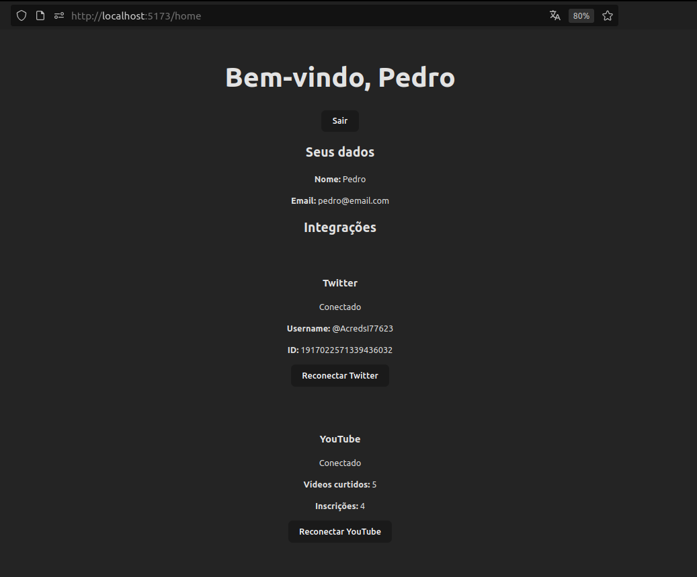

Este é um projeto com backend **Node.js** e frontend **React**, que oferece um sistema para o usuário se cadastrar, fazer login e integrar sua conta com o Twitter e o YouTube. Após o login, os dados do usuário e as integrações são exibidos na página inicial, podendo ser utilizados para outras finalidades posteriormente.



O sistema oferece suporte a:

✅ Cadastro e login com e-mail e senha  
✅ Geração de JWT e rotas protegidas  
✅ Vinculação com contas do **Twitter** e do **YouTube**  
✅ Extração de dados como vídeos curtidos, canais inscritos e informações do Twitter  
✅ Sessões com Express Session  

---

## 🚀 Tecnologias Utilizadas
  
- **Backend:** Node.js, Express, JWT, Bcrypt, Axios, Express-session  
- **Frontend:** React, React Router DOM, Axios, CSS
- **APIs de Terceiros:** Google OAuth (YouTube), Twitter OAuth 2.0  
- **Outros:** Dotenv, CORS, UUID

---

## 📦 Funcionalidades Principais

### 🧑‍💻 Autenticação de Usuário
- Registro de usuários com email, nome e senha
- Criptografia de senha com bcrypt
- Login com geração de **JWT**
- Middleware de rotas protegidas

### 🔗 Vinculação com Twitter
- OAuth 2.0 com PKCE
- Coleta de dados do usuário logado no Twitter (ID, nome, etc.)

### 📺 Vinculação com YouTube
- OAuth 2.0 via Google
- Coleta de:
  - Vídeos curtidos
  - Canais inscritos

---

## 📁 Organização do Projeto

```
/Social_Auth_API  
├── /back                 
│   ├── controllers/       # Lógica das rotas
│   ├── middlewares/       # Autenticação
│   ├── routes/            # Definição das rotas da API
│   ├── services/          # Integrações com APIs externas (Twitter, YouTube)
│   ├── .env               # Variáveis de ambiente
│   └── server.js          # Inicialização do servidor
│
├── /front                 
│   └── src/               
│       ├── pages/         # Páginas da aplicação
│       │   ├── cadastro.jsx
│       │   ├── login.jsx
│       │   └── home.jsx
│       ├── services/      # Comunicação com a API (Axios)
│       │   └── api.js
│       └── App.jsx        # Componente raiz da aplicação
│
└── README.md              # Este documento

```

  
---
  
## 🚀 Como Rodar o Projeto

## Backend

Acesse o diretório do backend `cd back/`

Instale as dependências  `npm install` 

Rode o servidor  `node server.js` 


## Frontend

Acesse o diretório do frontend  `cd front/` 

Instale as dependências  `npm install `
 
Rode a aplicação  `npm run dev` 

---

## 🔧 Configuração de Ambiente (.env)

No diretório `back/`, crie um arquivo `.env` com as seguintes variáveis:

```dotenv
# Porta do servidor
PORT=3000

# Sessão Express
SESSION_SECRET=sua_chave_secreta_para_session

# JWT
JWT_SECRET=sua_chave_secreta_para_jwt

# Twitter OAuth 2.0
CLIENT_ID=SEU_TWITTER_CLIENT_ID
CLIENT_SECRET=SEU_TWITTER_CLIENT_SECRET
REDIRECT_URL=http://localhost:3000/twitterHome

# Google OAuth (YouTube Data API)
GOOGLE_CLIENT_ID=SEU_GOOGLE_CLIENT_ID
GOOGLE_CLIENT_SECRET=SEU_GOOGLE_CLIENT_SECRET
```

## 🔧 Como obter as chaves OAuth

### Twitter Developer

Acesse https://developer.twitter.com

Crie um novo projeto e app

Em Settings → User authentication settings, configure o Callback URL (REDIRECT_URL) e anote Client ID e Client Secret.  

---


### Google Cloud Console

Acesse https://console.cloud.google.com/apis/credentials

Crie um OAuth 2.0 Client ID em Credentials

Configure o campo Authorized redirect URIs

Anote Client ID e Client Secret.
